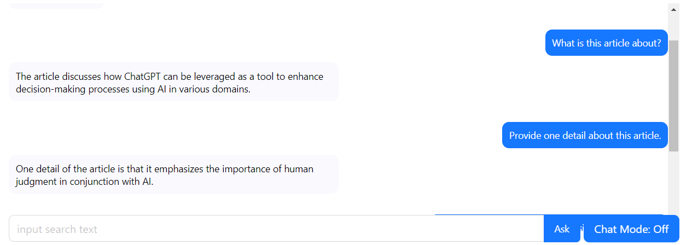

<!-- PROJECT LOGO -->
 

  

<h3 align="center">Congnify AI</h3>

  

    A Web-Based Full-Stack Q&ampA AI Agent for PDF Document Inquiries.
     
  

<!-- TABLE OF CONTENTS -->

  
<strong>Table of Contents</strong>

  <ol>
    <li>
      <a href="#about-the-project">About The Project</a>
    </li>
    <li>
      <a href="#built-with">Built With</a>
    </li>
    <li><a href="#usages">Usages</a></li>
    <li><a href="#contact">Contact</a></li>
    <li><a href="#acknowledgments">Acknowledgments</a></li>
  </ol>

<!-- ABOUT THE PROJECT -->
## About The Project

![Home Page Screenshot][homepage-screenshot]

Cognify AI is a sophisticated AI agent that can load, analyze, and parse PDF files, and engage in real-time conversations with users. 

Cognify is a combined term, created by combining "cognition" and "amplify". It is used to convey the idea of "enhancing cognition" and "boosting intelligence."

The user must first upload one or more PDFs, and then they can ask the agent questions.This application supports speech recognition, allowing users to choose voice input by opening the chat mode. If the user asks an unrelated question, Cognify will respond with "Sorry, I don’t know." For questions related to the content of the PDFs, Cognify will provide an concise answer within four sentences.

## Built With

* [ReactJs][React-url]
* [JavaScript](https://www.javascript.com/)
* [NodeJS](https://nodejs.org/en)
* [Express.js](https://expressjs.com/)
* [AntDesign](https://ant.design/)
* [LongChain](https://www.langchain.com/)
* [OpenAI API](https://platform.openai.com/)
  

(<a href="#readme-top">back to top</a>)

## Usages
 

    <ul>
        <li>Upload file(s)</li>
          
        
&nbsp;

        <li style="margin-top: 20px;">Speech recognition</li>
          
          <figcaption style="text-align: center; margin-top: 5px;">
            By opening the chat mode, the user can interact with the agent by talking.
          </figcaption>
        
&nbsp;

        <li style="margin-top: 20px;">Irrelevant questions</li>
          
          <figcaption style="text-align: center; margin-top: 5px;">
            Agent will only answer the question(s) related to the file(s).
          </figcaption>
        
&nbsp;

        <li>Real-time interactions</li>
          
          <figcaption style="margin-top: 5px;">
            CognifyAI will retrieval the PDF and output answers in a concise way, usually within four sentences. 
          </figcaption>
    </ul>

(<a href="#readme-top">back to top</a>)

<!-- CONTACT -->
## Contact

Built by: Hannah Luan - [LinkedIn][linkedin-url]

Contact me for the project link!

<!-- ACKNOWLEDGMENTS -->
## Acknowledgments

* [Multer](https://www.npmjs.com/package/multer)
* [Speak-tts](https://www.npmjs.com/package/speak-tts)
* [Git](https://github.com/)

(<a href="#readme-top">back to top</a>)

<!-- MARKDOWN LINKS & IMAGES -->
[linkedin-url]: https://www.linkedin.com/in/hannahluan/
[React.js]: https://img.shields.io/badge/React-20232A?style=for-the-badge&logo=react&logoColor=61DAFB
[React-url]: https://reactjs.org/
[homepage-screenshot]: Images/Introduction.png

